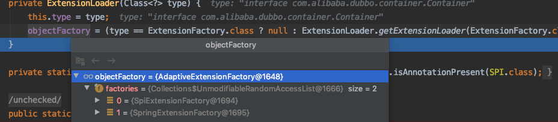

#### 为什么dubbo要自己设计一套SPI？
```text
1、JDK标准的SPI会一次性实例化扩展点的所有实现，如果有扩展点实现初始化很耗时，
但如果没有用上也被加载，会很浪费资源。
2、增加了对扩展点IOC和AOP对支持，一个扩展点可以直接setter注入到其它扩展点。
```

#### dubbo spi的约定？
```text
1、spi文件存储路径为META-INF\dubbo\internal，文件名为接口的全路径名
2、每个spi文件内容定义为：扩展名=具体类名。例如：dubbo=com.alibaba.dubbo.rpc.protocol.dubbo.DubboProtoco
```

#### dubbo spi源码
```text
dubbo spi目的：获取一个指定实现类对象。
途径：ExtensionLoader.getExtension(String name)

实现路径：
getExtensionLoader(Class<T> type) 就是为该接口new 一个ExtensionLoader，然后缓存起来。
getAdaptiveExtension() 获取一个扩展类，如果@Adaptive注解在类上就是一个装饰类；如果注解在方法上就是一个动态代理类，例如Protocol$Adaptive对象。
getExtension(String name) 获取一个指定对象。

-------------------源码------------------
ExtensionLoader.getExtensionLoader(Container.class);
-->this.type = type;
-->objectFactory = (type == ExtensionFactory.class ? null : ExtensionLoader.getExtensionLoader(ExtensionFactory.class).getAdaptiveExtension());
    -->ExtensionLoader.getExtensionLoader(ExtensionFactory.class).getAdaptiveExtension()
        -->this.type = type;
        -->objectFactory = null;

执行以上代码完成了2个属性的初始化
1.每个一个ExtensionLoader都包含了2个值 分别为type和objectFactory
    Class<?> type；//构造器  初始化时要得到的接口名
    ExtensionFactory objectFactory//构造器  初始化时 AdaptiveExtensionFactory[SpiExtensionFactory,SpringExtensionFactory]
2.实例化一个ExtensionLoader存储在ConcurrentMap<Class<?>, ExtensionLoader<?>> EXTENSION_LOADERS 

关于objectFactory的一些细节：
1.objectFactory就是ExtensionFactory，它也是通过ExtensionLoader.getExtensionLoader(ExtensionFactory.class)来实现的，但是它的objectFactory=null
2.objectFactory作用，它就是为dubbo的IOC提供所有对象。？？？？  
```
