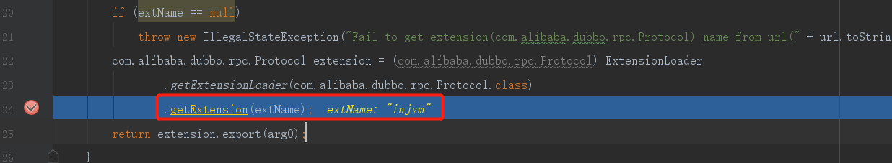
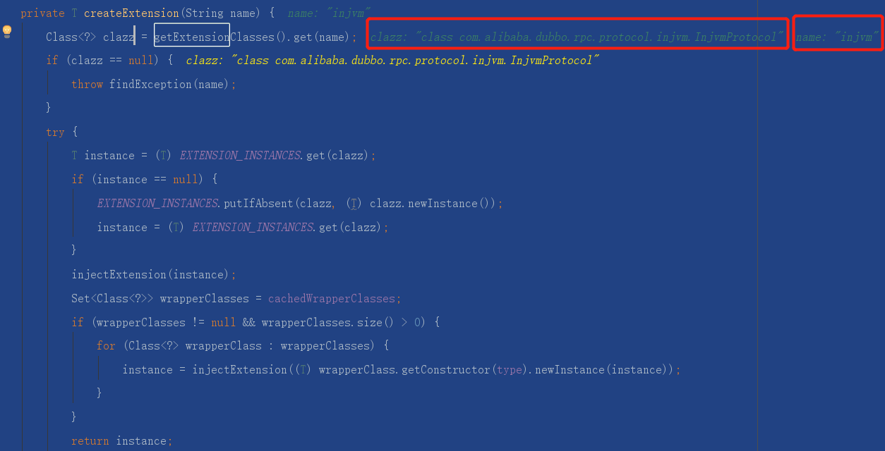
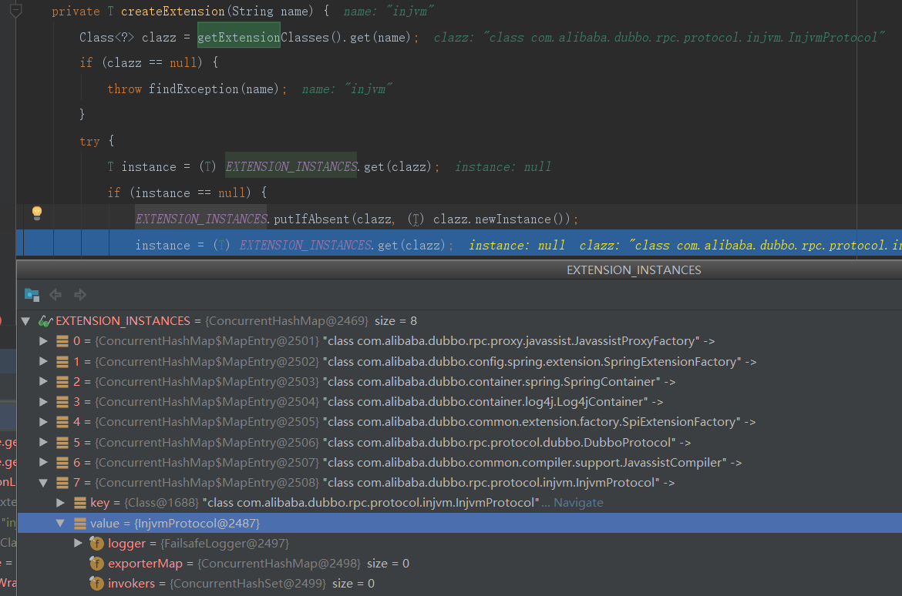
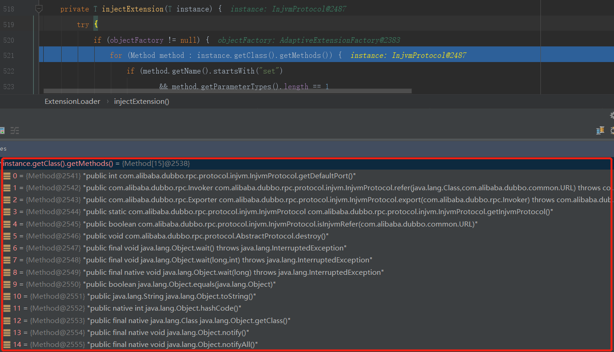
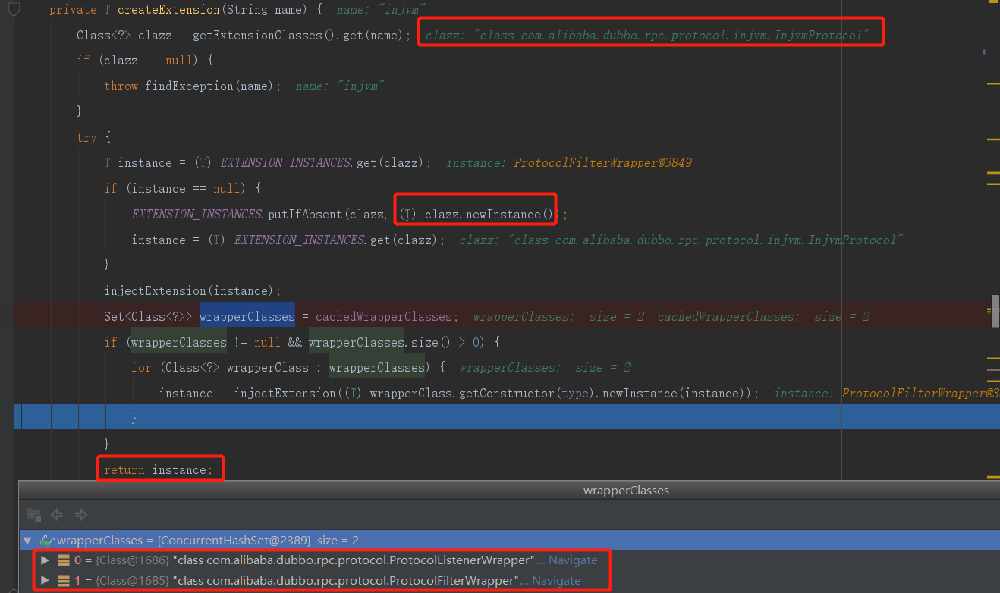
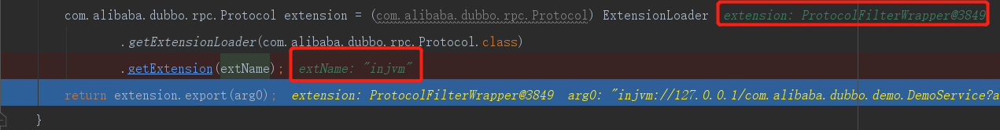

 #### getExtension(String name)源码解析
  
 ```text
getExtension(String name)// 指定对象缓存在cachedInstances；get出来的对象wrapper对象，例如Protocol就是ProtocolFilterWrapper和ProtocolListenerWrapper其中一个。
    -->createExtension (name);
        -->getExtensionClasses().get(name);
        -->injectExtension(instance);
            -->objectFactory.getExtension(pt, property);
                -->SpiExtensionFactory.getExtension(type, name);
                    -->ExtensionLoader.getExtensionLoader(type);
                        -->loader.getAdaptiveExtension(); 
                -->SpringExtensionFactory.getExtension(type, name);
                    -->context.getBean(name);
         -->injectExtension((T) wrapperClass.getConstructor(type).newInstance(instance));// AOP的简单设计      
```
#### createExtension (name);
 *  
 *  
 *  
 * 
 *  