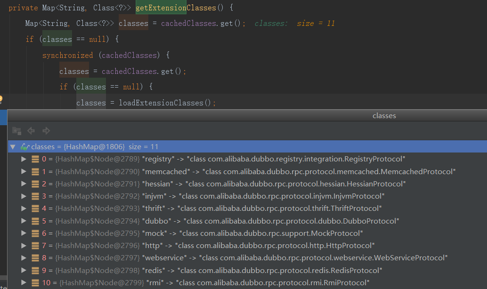
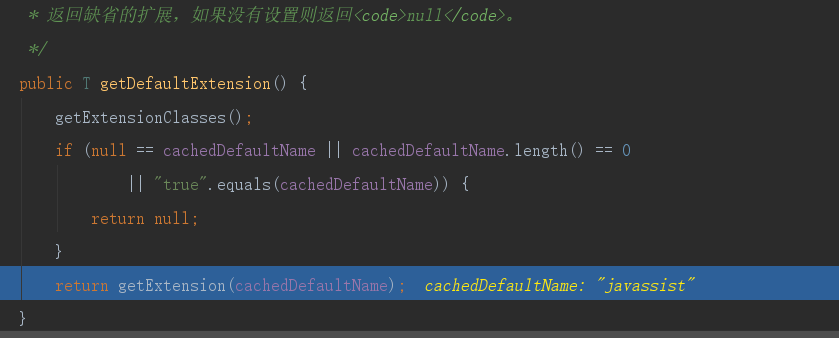
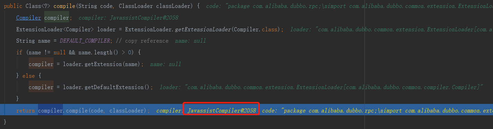
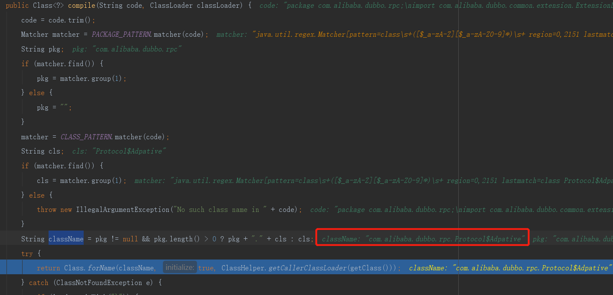

#### compiler.compile(code, classLoader)源码解析
```text
compiler.compile(code, classLoader);
    -->loader.getDefaultExtension();
    -->JavassistCompiler.compile(code, classLoader);
        -->doCompile(className, code);【参考CompilerByJavassist实现】
            
```
#### getDefaultExtension();
 *  
 *  
 *  
 * 