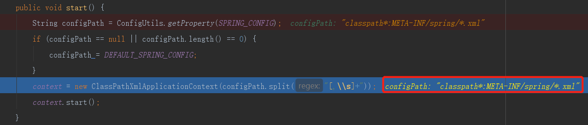
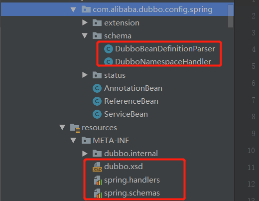

### 1、通过Spring容器启动Dubbo
```text
DemoProvider.main()
    -->SpringContainer.start()
        -->ClassPathXmlApplicationContext.start()
```


### 2、Dubbo实现Spring的schema配置的相关文件


### 3、自定义实现Spring的schema配置
```text
1、设计配置属性和JavaBean
2、编写XSD文件，全称为XML Schema Definition XML，作用就是校验XML，定义了一些列的语法来规范XML
3、编写NamespaceHandler和BeanDefinitionParser完成解析工作
4、编写spring.handlers和spring.schemas串联起所有部件
5、在Bean文件中应用
```