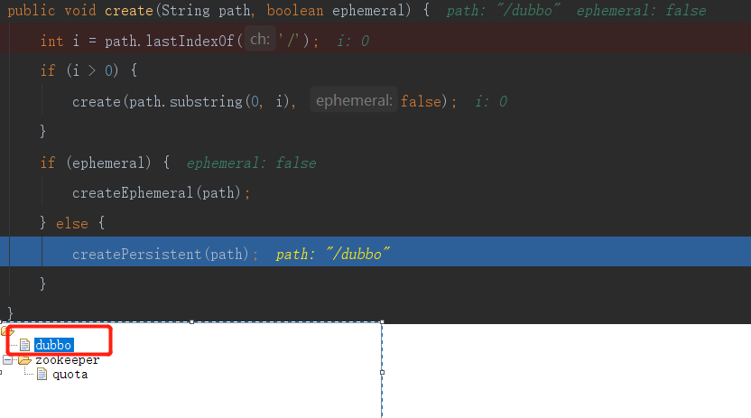
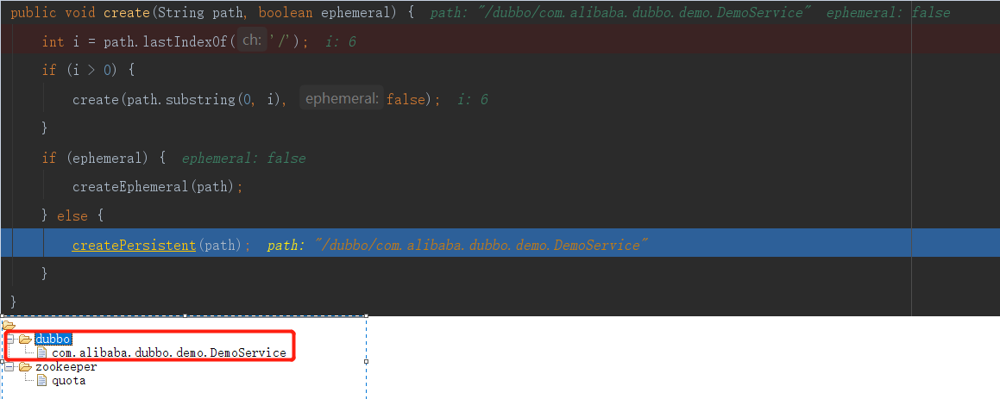
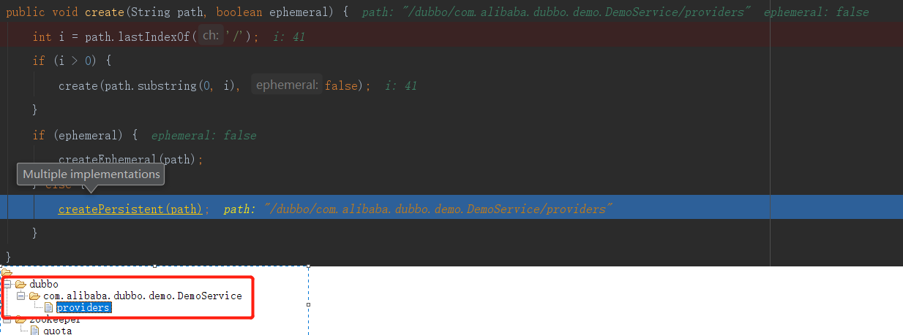
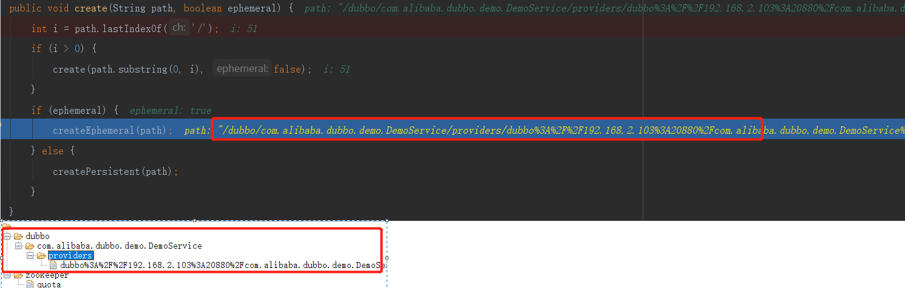

#### 1、Dubbo服务暴露流程
```text
1)、暴露本地服务
Export dubbo service com.alibaba.dubbo.demo.DemoService to local registry, dubbo version: 2.0.0, current host: 127.0.0.1
2)、暴露远程服务
Export dubbo service com.alibaba.dubbo.demo.DemoService to url dubbo://192.168.2.103:20880/com.alibaba.dubbo.demo.DemoService?anyhost=true&application=demo-provider&dubbo=2.0.0&generic=false&interface=com.alibaba.dubbo.demo.DemoService&loadbalance=roundrobin&methods=sayHello&owner=william&pid=2776&side=provider&timestamp=1590931950075, dubbo version: 2.0.0, current host: 127.0.0.1
Register dubbo service com.alibaba.dubbo.demo.DemoService url dubbo://192.168.2.103:20880/com.alibaba.dubbo.demo.DemoService?anyhost=true&application=demo-provider&dubbo=2.0.0&generic=false&interface=com.alibaba.dubbo.demo.DemoService&loadbalance=roundrobin&methods=sayHello&monitor=dubbo%3A%2F%2F127.0.0.1%3A2181%2Fcom.alibaba.dubbo.registry.RegistryService%3Fapplication%3Ddemo-provider%26dubbo%3D2.0.0%26owner%3Dwilliam%26pid%3D2776%26protocol%3Dregistry%26refer%3Ddubbo%253D2.0.0%2526interface%253Dcom.alibaba.dubbo.monitor.MonitorService%2526pid%253D2776%2526timestamp%253D1590931950179%26registry%3Dzookeeper%26timestamp%3D1590931950042&owner=william&pid=2776&side=provider&timestamp=1590931950075 to registry registry://127.0.0.1:2181/com.alibaba.dubbo.registry.RegistryService?application=demo-provider&dubbo=2.0.0&owner=william&pid=2776&registry=zookeeper&timestamp=1590931950042, dubbo version: 2.0.0, current host: 127.0.0.1
3)、启动Netty
Start NettyServer bind /0.0.0.0:20880, export /192.168.2.103:20880, dubbo version: 2.0.0, current host: 127.0.0.1
4)、打开链接zk
INFO zookeeper.ClientCnxn: Opening socket connection to server 127.0.0.1/127.0.0.1:2181. Will not attempt to authenticate using SASL (unknown error)
5)、到zk注册
Register: dubbo://192.168.2.103:20880/com.alibaba.dubbo.demo.DemoService?anyhost=true&application=demo-provider&dubbo=2.0.0&generic=false&interface=com.alibaba.dubbo.demo.DemoService&loadbalance=roundrobin&methods=sayHello&owner=william&pid=2776&side=provider&timestamp=1590931950075, dubbo version: 2.0.0, current host: 127.0.0.1
6)、监听zk
Subscribe: provider://192.168.2.103:20880/com.alibaba.dubbo.demo.DemoService?anyhost=true&application=demo-provider&category=configurators&check=false&dubbo=2.0.0&generic=false&interface=com.alibaba.dubbo.demo.DemoService&loadbalance=roundrobin&methods=sayHello&owner=william&pid=2776&side=provider&timestamp=1590931950075, dubbo version: 2.0.0, current host: 127.0.0.1
Notify urls for subscribe url provider://192.168.2.103:20880/com.alibaba.dubbo.demo.DemoService?anyhost=true&application=demo-provider&category=configurators&check=false&dubbo=2.0.0&generic=false&interface=com.alibaba.dubbo.demo.DemoService&loadbalance=roundrobin&methods=sayHello&owner=william&pid=2776&side=provider&timestamp=1590931950075, urls: [empty://192.168.2.103:20880/com.alibaba.dubbo.demo.DemoService?anyhost=true&application=demo-provider&category=configurators&check=false&dubbo=2.0.0&generic=false&interface=com.alibaba.dubbo.demo.DemoService&loadbalance=roundrobin&methods=sayHello&owner=william&pid=2776&side=provider&timestamp=1590931950075], dubbo version: 2.0.0, current host: 127.0.0.1
```
#### 2、源码解析
```text
ServiceBean.onApplicationEvent(ApplicationEvent event)
    -->export();
        -->doExport();
            -->doExportUrls();里面有一个for循环，代表了一个服务可以有多个通信协议，例如 tcp协议 http协议，默认是tcp协议
                -->loadRegistries(true);//从dubbo.properties里面组装registry的url信息
                -->doExportUrlsFor1Protocol(protocolConfig, registryURLs);// protocolConfig=<dubbo:protocol name="dubbo" port="20880" id="dubbo" /> registryURLs=registry://127.0.0.1:2181/com.alibaba.dubbo.registry.RegistryService?application=demo-provider&dubbo=2.0.0&owner=william&pid=12080&registry=zookeeper&timestamp=1590937523584
                    配置不是remote的情况下做本地暴露 (配置为remote，则表示只暴露远程服务)
                    -->exportLocal(url);
                        -->proxyFactory.getInvoker(ref, (Class) interfaceClass, local)// proxyFactory=ProxyFactory$Adpative ref=<bean id="demoService" class="com.alibaba.dubbo.demo.provider.DemoServiceImpl"/> interfaceClass=com.alibaba.dubbo.demo.DemoService local=injvm://127.0.0.1/com.alibaba.dubbo.demo.DemoService?anyhost=true&application=demo-provider&dubbo=2.0.0&generic=false&interface=com.alibaba.dubbo.demo.DemoService&loadbalance=roundrobin&methods=sayHello&owner=william&pid=12080&side=provider&timestamp=1590937926755
                             -->ExtensionLoader.getExtensionLoader(ProxyFactory.class).getExtension("javassist");
                             -->extension.getInvoker(T proxy, Class<T> type, URL url);// extension=StubProxyFactoryWrapper
                                -->proxyFactory.getInvoker(proxy, type, url);// proxyFactory=JavassistProxyFactory
                                    -->Wrapper.getWrapper(com.alibaba.dubbo.demo.provider.DemoServiceImpl)
                                    -->return new AbstractProxyInvoker<T>(proxy, type, url)
                        -->protocol.export(invoker);
                            -->Protocol$Adpative.export
                                -->ExtensionLoader.getExtensionLoader(Protocol.class).getExtension("injvm");
                                    -->extension.export(arg0);// extension=ProtocolFilterWrapper
                                        -->buildInvokerChain(invoker, Constants.SERVICE_FILTER_KEY, Constants.PROVIDER);// 创建8个filter
                                        -->protocol.export(); // protocol=ProtocolListenerWrapper
                                            -->protocol.export(invoker);// protocol=InjvmProtocol
                                                -->return new InjvmExporter<T>(invoker, invoker.getUrl().getServiceKey(), exporterMap);
                                                -->本地暴露目的：exporterMap.put(key, this);// this.invoker = invoker, key=com.alibaba.dubbo.demo.DemoService, this=InjvmExporter
                    如果配置不是local则暴露为远程服务.(配置为local，则表示只暴露本地服务)
                    protocol.export(invoker);// protocol=Protocol$Adpative
                        -->ExtensionLoader.getExtensionLoader(Protocol.class).getExtension("registry");
                        -->extension.export(arg0);// extension=ProtocolFilterWrapper
                            -->protocol.export(invoker);// protocol=ProtocolListenerWrapper
                                -->protocol.export(invoker);// protocol=RegistryProtocol
                                    -->doLocalExport(originInvoker);
                                        -->getCacheKey(originInvoker);// 读取key
                                        -->protocol.export(invokerDelegete);// protocol=Protocol$Adpative
                                            -->ExtensionLoader.getExtensionLoader(Protocol.class).getExtension("dubbo");
                                            -->extension.export(arg0);// extension=ProtocolFilterWrapper
                                                -->buildInvokerChain();// 创建8个filter
                                                -->protocol.export();// protocol=ProtocolListenerWrapper
---------------------------------------------------1、netty服务暴露的开始-----------------------------------------------
                                                    -->protocol.export(invoker);// protocol=DubboProtocol
                                                        -->serviceKey(url);// 组装key=com.alibaba.dubbo.demo.DemoService:20880
                                                        -->new DubboExporter<T>(invoker, key, exporterMap);// this.invoker=invoker, this.key=key, this.exporterMap=exporterMap
                                                        -->exporterMap.put(key, exporter);// key=com.alibaba.dubbo.demo.DemoService:20880, this=DubboExporter
                                                        -->openServer(url);
                                                            -->createServer(url);
---------------------------------------------------2、信息交换层exchanger开始-------------------------------------------
                                                                -->Exchangers.bind(url, requestHandler);// exchanger是一个信息交换层
                                                                    -->getExchanger(url)
                                                                        -->getExchanger("header");
                                                                            -->ExtensionLoader.getExtensionLoader(Exchanger.class).getExtension("header");
                                                                    -->HeaderExchanger.bind(url, handler);
                                                                        -->new HeaderExchangeHandler(handler)//this.handler = handler
                                                                        -->new DecodeHandler();
                                                                            -->new AbstractChannelHandlerDelegate();// this.handler = handler;
---------------------------------------------------3、网络传输层transporter---------------------------------------------
                                                                        -->Transporters.bind(URL url, ChannelHandler... handlers)
                                                                            -->getTransporter();
                                                                                -->ExtensionLoader.getExtensionLoader(Transporter.class).getAdaptiveExtension();
                                                                            -->getTransporter().bind(url, handler);// getTransporter()=Transporter$Adpative
                                                                                -->ExtensionLoader.getExtensionLoader(Transporter.class).getExtension("netty");
                                                                                -->extension.bind(arg0, arg1); // extension=NettyTransporter
                                                                                    -->new NettyServer(url, listener);
                                                                                        -->AbstractPeer(URL url, ChannelHandler handler);// this.url = url; this.handler = handler;
                                                                                        -->AbstractEndpoint(URL url, ChannelHandler handler);// this.codec; this.timeout=1000(请求超时时间); this.connectTimeout=3000(连接超时时间);
                                                                                        -->AbstractServer(URL url, ChannelHandler handler);// bindAddress(设置绑定地址); idleTimeout=600s
---------------------------------------------------4、打开端口，暴露Netty服务-------------------------------------------
                                                                                            -->doOpen();
                                                                                                -->new NioServerSocketChannelFactory(boss, worker, 3);// 设置boss、worker的线程池，线程的个数为3
                                                                                                -->new ServerBootstrap(channelFactory);// 实例化服务启动帮助类
                                                                                                -->设置解码器、编码器、handler
                                                                                                -->bootstrap.bind(getBindAddress());// 绑定服务端的IP和端口，完成服务端的启动，监听客户端的连接。
                                                                        -->new HeaderExchangeServer(NettyServer);
                                                                            -->this.server = NettyServer;
                                                                            -->this.heartbeat = 60000;// 心跳包间隔时间
                                                                            -->this.heartbeatTimeout = 180000;// 心跳超时时间
                                                                            -->startHeatbeatTimer();// 启动心跳定时器 采用了线程池，如果断开就心跳重连。 
---------------------------------------------------连接zk---------------------------------------------------------------                                                                            
                                    -->getRegistry(originInvoker); // 连接zk    
                                        -->registryFactory.getRegistry(registryUrl);// registryFactory=RegistryFactory$Adpative
                                            -->ExtensionLoader.getExtensionLoader(RegistryFactory.class).getExtension("zookeeper");
                                            -->extension.getRegistry(arg0);// extension=ZookeeperRegistryFactory
                                                -->AbstractRegistryFactory.getRegistry(arg0);// 创建一个Registry,保存到注册中心集合 Map<RegistryAddress, Registry> REGISTRIES
                                                    -->createRegistry(url);// ZookeeperRegistryFactory.createRegistry(URL url) 
                                                        -->new ZookeeperRegistry(url, zookeeperTransporter); 
                                                            -->AbstractRegistry(URL url);// this.registryUrl = url; 
                                                                -->loadProperties(); // 把C:\Users\Administrator/.dubbo/dubbo-registry-127.0.0.1.cache文件中的内容加载为properties
                                                                -->notify(url.getBackupUrls());// 不做任何事  
                                                            -->FailbackRegistry(URL url); // retryPeriod=5000(重试时间间隔)     
                                                                -->retryExecutor.scheduleWithFixedDelay(new Runnable());// 建立线程池，检测并连接注册中心,如果失败了就重连 
                                                            -->zookeeperTransporter.connect(url);// zookeeperTransporter=ZookeeperTransporter$Adpative
                                                                -->ExtensionLoader.getExtensionLoader(ZookeeperTransporter.class).getExtension("zkclient");  
                                                                -->extension.connect(arg0);// extension=ZkclientZookeeperTransporter    
                                                                    -->new ZkclientZookeeperClient(url);
                                                                        -->AbstractZookeeperClient(URL url);// this.url = url;
                                                                        -->new ZkClient(url.getBackupAddress()); // 连接ZK url.getBackupAddress()=127.0.0.1:2181 
                                                                        -->client.subscribeStateChanges(new IZkStateListener());// 订阅的目的：连接断开，重连
                                                             -->zkClient.addStateListener(new StateListener())
                                                                -->recover();// 重连 
---------------------------------------------------到zk注册，创建节点---------------------------------------------------
                                    -->registry.register(registedProviderUrl);// registedProviderUrl=dubbo://192.168.2.103:20880/com.alibaba.dubbo.demo.DemoService?anyhost=true&application=demo-provider&dubbo=2.0.0&generic=false&interface=com.alibaba.dubbo.demo.DemoService&loadbalance=roundrobin&methods=sayHello&owner=william&pid=8876&side=provider&timestamp=1591052907483
                                        -->AbstractRegistry.register(URL url);// registered.add(url);
                                        -->FailbackRegistry.register(URL url);
                                            -->doRegister(url);// 向服务器端发送注册请求
                                                -->ZookeeperRegistry.doRegister(URL url);
                                                    -->zkClient.create(toUrlPath(url), url.getParameter(Constants.DYNAMIC_KEY, true));// toUrlPath(url)=/dubbo/com.alibaba.dubbo.demo.DemoService/providers/dubbo://192.168.2.103:20880/com.alibaba.dubbo.demo.DemoService?anyhost=true&application=demo-provider&dubbo=2.0.0&generic=false&interface=com.alibaba.dubbo.demo.DemoService&loadbalance=roundrobin&methods=sayHello&owner=william&pid=8876&side=provider&timestamp=1591052907483
                                                        -->AbstractZookeeperClient.create(String path, boolean ephemeral);
                                                            -->createEphemeral(path);// 创建临时节点 /dubbo/com.alibaba.dubbo.demo.DemoService/providers/dubbo://192.168.2.103:20880/com.alibaba.dubbo.demo.DemoService?anyhost=true&application=demo-provider&dubbo=2.0.0&generic=false&interface=com.alibaba.dubbo.demo.DemoService&loadbalance=roundrobin&methods=sayHello&owner=william&pid=8876&side=provider&timestamp=1591052907483
                                                            -->createPersistent(path); // 创建持久会节点 1)、/dubbo 2)、/dubbo/com.alibaba.dubbo.demo.DemoService 3)、/dubbo/com.alibaba.dubbo.demo.DemoService/providers
---------------------------------------------------订阅zk---------------------------------------------------------------                                                  
                                    -->registry.subscribe(overrideSubscribeUrl, overrideSubscribeListener);// registry=ZookeeperRegistry
                                        -->AbstractRegistry.subscribe(URL url, NotifyListener listener);// 将listener添加到ConcurrentMap<URL, Set<NotifyListener>> subscribed中，其中key=provider://192.168.2.103:20880/com.alibaba.dubbo.demo.DemoService?anyhost=true&application=demo-provider&category=configurators&check=false&dubbo=2.0.0&generic=false&interface=com.alibaba.dubbo.demo.DemoService&loadbalance=roundrobin&methods=sayHello&owner=william&pid=15844&side=provider&timestamp=1591098147139，value=new ConcurrentHashSet<NotifyListener>()。listener存储到ConcurrentHashSet中
                                        -->FailbackRegistry.subscribe(URL url, NotifyListener listener);
                                            -->doSubscribe(url, listener);// 向服务器端发送订阅请求。
                                                -->ZookeeperRegistry.doSubscribe(final URL url, final NotifyListener listener)
                                                    -->new ChildListener();// 将new ChildListener()添加到new ConcurrentHashMap<NotifyListener, ChildListener>()，其中key=listener，value=new ChildListener()，缓存到ConcurrentMap<URL, ConcurrentMap<NotifyListener, ChildListener>> zkListeners中key=provider://192.168.2.103:20880/com.alibaba.dubbo.demo.DemoService?anyhost=true&application=demo-provider&category=configurators&check=false&dubbo=2.0.0&generic=false&interface=com.alibaba.dubbo.demo.DemoService&loadbalance=roundrobin&methods=sayHello&owner=william&pid=15844&side=provider&timestamp=1591098147139
                                                        -->实现了childChanged(String parentPath, List<String> currentChilds)
                                                            -->ZookeeperRegistry.this.notify(url, listener, toUrlsWithEmpty(url, parentPath, currentChilds));
                                                    AAA)、先创建持久化节点/dubbo/com.alibaba.dubbo.demo.DemoService/configurators        
                                                    -->zkClient.create(path, false); // 创建持久节点 path=/dubbo/com.alibaba.dubbo.demo.DemoService/configurators
                                                    -->zkClient.addChildListener(path, zkListener);// zkClient=ZkclientZookeeperClient
                                                        -->createTargetChildListener(path, listener);
                                                            -->ZkclientZookeeperClient.createTargetChildListener(String path, final ChildListener listener);// ZookeeperRegistry.doSubscribe中实例化的ChildListener
                                                                -->new IZkChildListener();
                                                                    CCC)、收到订阅回调后，交给FailbackRegistry.notify处理
                                                                    -->实现了handleChildChange(String parentPath, List<String> currentChilds);// parentPath=/dubbo/com.alibaba.dubbo.demo.DemoService/configurators
                                                                        -->添加ZookeeperRegistry.doSubscribe中实例化的ChildListener.childChanged(parentPath, currentChilds);
                                                                            -->ZookeeperRegistry.this.notify(url, listener, toUrlsWithEmpty(url, parentPath, currentChilds));// 3={empty://192.168.2.103:20880/com.alibaba.dubbo.demo.DemoService?anyhost=true&application=demo-provider&category=configurators&check=false&dubbo=2.0.0&generic=false&interface=com.alibaba.dubbo.demo.DemoService&loadbalance=roundrobin&methods=sayHello&owner=william&pid=2340&side=provider&timestamp=1591103054207}
                                                                                -->FailbackRegistry.notifynotify(URL url, NotifyListener listener, List<URL> urls)
                                                                                    -->doNotify(url, listener, urls);
                                                                                        -->AbstractRegistry.notify(URL url, NotifyListener listener, List<URL> urls)
                                                                                            -->saveProperties(url);//把服务端的注册url信息更新到C:\Users\Administrator\.dubbo\dubbo-registry-192.168.48.117.cache
                                                                                                -->registryCacheExecutor.execute(new SaveProperties(version));// //采用线程池来处理
                                                                                            -->listener.notify(categoryList); // listener=RegistryProtocol$OverrideListener
                                                                                                -->URL originUrl = RegistryProtocol.this.getProviderUrl(originInvoker);
                                                                                                   -->RegistryProtocol.this.doChangeLocalExport(originInvoker, newUrl);//对修改了url的invoker重新export
                                                        BBB)、对path=/dubbo/com.alibaba.dubbo.demo.DemoService/configurators 进行订阅                                           
                                                        -->addTargetChildListener(path, targetListener); 
                                                            -->ZkclientZookeeperClient.addTargetChildListener(String path, final IZkChildListener listener)
                                                                -->client.subscribeChildChanges(path, listener);// /dubbo/com.alibaba.dubbo.demo.DemoService/configurators                                                                                                               
```

#### 3、暴露本地服务和暴露远程服务的区别？
```text
1、暴露本地服务：指暴露在用一个JVM里面，不用通过调用zk来进行远程通信。
例如：在同一个服务，自己调用自己的接口，就没必要进行网络IP连接来通信。
2、暴露远程服务：指暴露给远程客户端的IP和端口号，通过网络来实现通信。
```

#### 4、节点创建过程
 *  
 *  
 *  
 * 