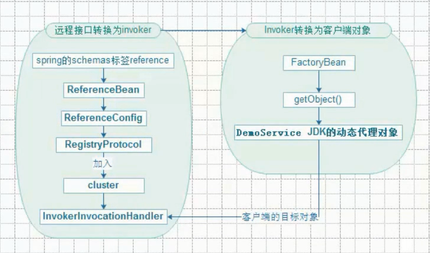

#### 0、Dubbo服务引用 整体架构图


#### 1、Dubbo服务引用流程
```text
ReferenceBean.getObject();// 框架真正进行服务引用的入口
    -->ReferenceConfig.get();
        -->init();
            -->ref = createProxy(map);
                -->refprotocol.refer(interfaceClass, urls.get(0));// refprotocol=Protocol$Adpative
                    -->ExtensionLoader.getExtensionLoader(Protocol.class).getExtension("registry");
                    -->extension.refer(arg0, arg1);// extension=ProtocolFilterWrapper
                        -->ProtocolFilterWrapper.refer(Class<T> type, URL url);
                            -->RegistryProtocol.refer(Class<T> type, URL url);
                                -->registryFactory.getRegistry(url);// 连接Zookeeper,和服务端发布一样(省略，参见服务发布) url=zookeeper://127.0.0.1:2181/com.alibaba.dubbo.registry.RegistryService?application=demo-consumer&dubbo=2.0.0&pid=16464&refer=application=demo-consumer&check=false&dubbo=2.0.0&interface=com.alibaba.dubbo.demo.DemoService&methods=sayHello&monitor=dubbo://127.0.0.1:2181/com.alibaba.dubbo.registry.RegistryService?application=demo-consumer&dubbo=2.0.0&pid=16464&protocol=registry&refer=dubbo=2.0.0&interface=com.alibaba.dubbo.monitor.MonitorService&pid=16464&timestamp=1591115230503&registry=zookeeper&timestamp=1591115230485&pid=16464&side=consumer&timestamp=1591115228461&timestamp=1591115230485
                                    -->doRefer(cluster, registry, type, url);
                                        // 创建zk的节点，和服务端发布一样（省略代码）。节点名为：dubbo/com.alibaba.dubbo.demo.DemoService/consumers
                                        -->registry.register(subscribeUrl.addParameters(Constants.CATEGORY_KEY, Constants.CONSUMERS_CATEGORY,Constants.CHECK_KEY, String.valueOf(false)));// 参数=consumer://192.168.43.156/com.alibaba.dubbo.demo.DemoService?application=demo-consumer&category=consumers&check=false&dubbo=2.0.0&interface=com.alibaba.dubbo.demo.DemoService&methods=sayHello&pid=16464&side=consumer&timestamp=1591115228461
                                        // 订阅zk的节点，和服务端发布一样（省略代码）。对节点/dubbo/com.alibaba.dubbo.demo.DemoService/providers，/dubbo/com.alibaba.dubbo.demo.DemoService/configurators，/dubbo/com.alibaba.dubbo.demo.DemoService/routers作监听(订阅)
                                        -->directory.subscribe(subscribeUrl.addParameter(Constants.CATEGORY_KEY, Constants.PROVIDERS_CATEGORY + "," + Constants.CONFIGURATORS_CATEGORY + "," + Constants.ROUTERS_CATEGORY));// 参数=consumer://192.168.43.156/com.alibaba.dubbo.demo.DemoService?application=demo-consumer&category=providers,configurators,routers&check=false&dubbo=2.0.0&interface=com.alibaba.dubbo.demo.DemoService&methods=sayHello&pid=16464&side=consumer&timestamp=1591115228461
                                            -->notify(url, listener, urls);
                                                -->FailbackRegistry.notify(URL url, NotifyListener listener, List<URL> urls);
                                                    -->doNotify(url, listener, urls);
                                                        -->AbstractRegistry.notify(URL url, NotifyListener listener, List<URL> urls);
                                                            -->saveProperties(url);把服务端的注册url信息更新到C:\Users\Administrator\.dubbo\dubbo-registry-192.168.48.117.cache
                                                                -->-->registryCacheExecutor.execute(new SaveProperties(version));//采用线程池来处理
                                                            -->listener.notify(categoryList);// listener=RegistryDirectory
                                                                // 最终目的：刷新Map<String, Invoker<T>> urlInvokerMap 对象,刷新Map<String, List<Invoker<T>>> methodInvokerMap对象
                                                                -->refreshInvoker(invokerUrls);
                                                                    -->destroyUnusedInvokers(oldUrlInvokerMap, newUrlInvokerMap);// 关闭未使用的Invoker
                                        -->cluster.join(directory);// cluster=Cluster$Adpative
                                            -->ExtensionLoader.getExtensionLoader(Cluster.class).getExtension("failover");
                                            -->extension.join(arg0);// extension=MockClusterWrapper
                                                -->this.cluster.join(directory)
                                                    -->return new FailoverClusterInvoker<T>(directory);
                                                -->new MockClusterInvoker<T>(directory, this.cluster.join(directory));
                -->proxyFactory.getProxy(invoker);//  proxyFactory=ProxyFactory$Adpative, invoker=MockClusterInvoker
                    -->ExtensionLoader.getExtensionLoader(ProxyFactory.class).getExtension("javassist"); 
                    -->extension.getProxy(arg0);// extension=StubProxyFactoryWrapper     
                        -->proxyFactory.getProxy(invoker);// proxyFactory=JavassistProxyFactory, invoker=MockClusterInvoker                                    
                            -->getProxy(invoker, interfaces);// invoker=MockClusterInvoker, interfaces=Class{com.alibaba.dubbo.demo.DemoService,com.alibaba.dubbo.rpc.service.EchoService}
                                -->JavassistProxyFactory.getProxy(Invoker<T> invoker, Class<?>[] interfaces);
                                    -->new InvokerInvocationHandler(invoker);//invoker=MockClusterInvoker采用jdk自带的InvocationHandler，创建InvokerInvocationHandler对象。
                                    -->Proxy.getProxy(interfaces).newInstance(new InvokerInvocationHandler(invoker));
                                        -->Proxy.getProxy(interfaces);
                                        
                                        
                                        
```