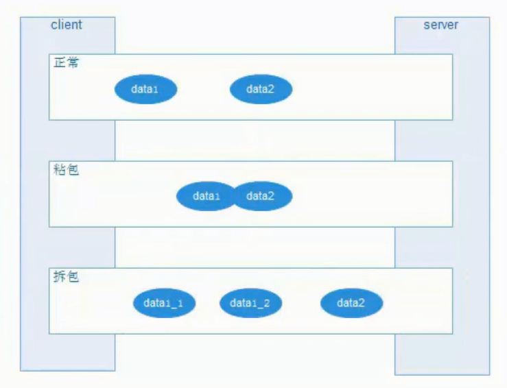

### 编码解码
```text
编码（Encode）称为序列化（serialization），它将对象序列化为字节数组，用于网络传输、数据持久化或者其它用途。
解码（Decode）反序列化（deserialization）把从网络、磁盘等读取的字节数组还原成原始对象（通常是原始对象的拷贝），以方便后续的业务逻辑操作。
```
### tcp 为什么会出现粘包拆包的解决方案?
```text
1.消息的定长，例如定1000个字节
2.就是在包尾增加回车或空格等特殊字符作为切割，典型的FTP协议
3.将消息分为消息头消息体。例如 dubbo
```
### TCP粘包拆包问题图解


### consumer请求编码解析
```text
NettyCodecAdapter.InternalEncoder.encode
    -->DubboCountCodec.encode
        -->ExchangeCodec.encode
            // byte[] header = new byte[16]; 定义一个定长为16字节的头信息
            // Bytes.short2bytes(MAGIC, header); 设置头信息的头两个字节为固定数字，魔数。
            // header[2] = (byte) (FLAG_REQUEST | serialization.getContentTypeId()); 设置双向(有去有回)或者单向(有去无回)的标记
            // request 第四个字节为空
            // Bytes.long2bytes(req.getId(), header, 4); // 第5-12个字节，请求id：long型8个字节。异步变同步的全局唯一ID，用来做consumer和provider的来回通信标记。
            // buffer.writerIndex(savedWriteIndex + HEADER_LENGTH + len);// 第13-16个字节：消息体的长度，也就是消息头+请求数据的长度。
            -->ExchangeCodec.encodeRequest
                -->DubboCodec.encodeRequestData
```
### provider请求解码解析
```text
NettyCodecAdapter.InternalDecoder.messageReceived
    -->DubboCountCodec.decode
        // int readable = buffer.readableBytes(); 取出消息的总长度
        // byte[] header = new byte[Math.min(readable, HEADER_LENGTH)]; 取出消息头信息
        -->ExchangeCodec.decode(Channel channel, ChannelBuffer buffer)
            // readable > 0 && header[0] != MAGIC_HIGH || readable > 1 && header[1] != MAGIC_LOW 对魔数进行检查
            // int len = Bytes.bytes2int(header, 12); 取出13-16个字节信息，即消息的总长度检查
            -->ExchangeCodec.decode(Channel channel, ChannelBuffer buffer, int readable, byte[] header)
                // byte flag = header[2], proto = (byte) (flag & SERIALIZATION_MASK); 取出第3个字节，对单向或者双向做验证
                // long id = Bytes.bytes2long(header, 4); 从第5个字节开始取ID
                // data = decodeRequestData(channel, in); 将消息体转换为data封装为Request返回。完成解码。
                -->ExchangeCodec.decodeBody
```
#### provider响应结果进行编码
```text
-->NettyCodecAdapter.InternalEncoder.encode
    -->DubboCountCodec.encode
        -->ExchangeCodec.encode
            // byte[] header = new byte[HEADER_LENGTH]; 定义一个定长为16字节的头信息
            // Bytes.short2bytes(MAGIC, header); 设置头信息的头两个字节为固定数字，魔数。
            // header[2] = serialization.getContentTypeId(); 第3个字节：序列号组件类型，它用于和客户端约定的序列号编码号
            // byte status = res.getStatus(); header[3] = status; 第4个字节：它是response的结果响应码  例如 OK=20
            // Bytes.long2bytes(req.getId(), header, 4); // 第5-12个字节，请求id：long型8个字节。异步变同步的全局唯一ID，用来做consumer和provider的来回通信标记。
            // buffer.writerIndex(savedWriteIndex + HEADER_LENGTH + len);// 第13-16个字节：消息体的长度，也就是消息头+请求数据的长度。
            -->ExchangeCodec.encodeResponse
                -->DubboCodec.encodeResponseData 先写入一个字节 这个字节可能是RESPONSE_NULL_VALUE  RESPONSE_VALUE  RESPONSE_WITH_EXCEPTION
```
#### consumer响应结果解码
```text
NettyCodecAdapter.InternalDecoder.messageReceived
    -->DubboCountCodec.decode
        -->ExchangeCodec.decode
            -->DubboCodec.decodeBody
                -->DecodeableRpcResult.decode//byte flag = in.readByte(); 根据RESPONSE_NULL_VALUE  RESPONSE_VALUE  RESPONSE_WITH_EXCEPTION进行响应的处理
```
#### DubboCountCodec.decode(Channel channel, ChannelBuffer buffer)循环查找的意义？
```text
解决粘包和拆包问题。
public Object decode(Channel channel, ChannelBuffer buffer) throws IOException {
    int save = buffer.readerIndex();
    MultiMessage result = MultiMessage.create();
    do {
        Object obj = codec.decode(channel, buffer);
        if (Codec2.DecodeResult.NEED_MORE_INPUT == obj) {
            buffer.readerIndex(save);
            break;
        } else {
            result.addMessage(obj);
            logMessageLength(obj, buffer.readerIndex() - save);
            save = buffer.readerIndex();
        }
    } while (true);
    if (result.isEmpty()) {
        return Codec2.DecodeResult.NEED_MORE_INPUT;
    }
    if (result.size() == 1) {
        return result.get(0);
    }
    return result;
}
```